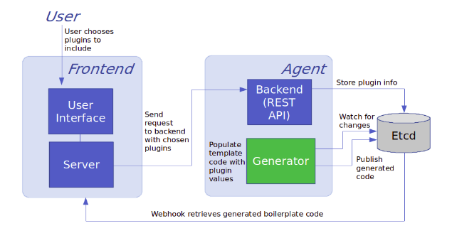

# Osseus

[](https://github.com/ligato/osseus/blob/master/LICENSE.md)

Osseus is full-stack web application for generating configurable plugin templates to be used in a wide variety of cloud-based applications. The user is able to select from available plugins provided by [CN-Infra](https://github.com/ligato/cn-infra) and generate working Go code to be immediately usable in an application.

## Development Installation

### First, clone the repo or pull off Dockerhub:
```
git clone https://github.com/ligato/osseus
cd /osseus
-or-
docker pull anthonydevelops/agent:dev
docker pull anthonydevelops/ui:dev
```
### Build the UI & Agent images:<br/>
*(Only if you chose to clone instead of pull in previous step)*
```bash
# UI
docker build --force-rm=true -t ui --no-cache -f docker/ui/Dockerfile .

# Agent
docker build --force-rm=true -t agent --build-arg AGENT_COMMIT=2c2b0df32201c9bc814a167e0318329c78165b5c --no-cache -f docker/agent/Dockerfile .
```

### Build and run ETCD **before** running the Agent container:
```bash
docker run -p 2379:2379 --name etcd --rm quay.io/coreos/etcd:v3.1.0 /usr/local/bin/etcd -advertise-client-urls http://0.0.0.0:2379 -listen-client-urls http://0.0.0.0:2379
```

### Lastly, run UI and Agent:
```bash

# Agent
(If chose to clone)
docker run -p 9191:9191 --name agent --privileged --rm agent
-or-
(If chose to pull)
docker run -p 9191:9191 anthonydevelops/agent:dev

# UI
(If chose to clone)
docker run --name ui --privileged --rm ui
-or-
(If chose to pull)
docker run anthonydevelops/ui:dev

```

**NOTE:**
To test everything is working properly, first make sure that there are no errors in any of the build processes or when the containers start up. Then, simply go to the local network endpoint where the **ui** is displayed, click new project, choose some plugins & click "save project". You'll then see Agent go through transactions and can double check that the k-v pairs were stored successfully in etcd by running ```etcdctl get --from-key ''```.

## Documentation

Detailed documentation can be found [here](https://github.com/ligato/osseus/tree/master/docs).

## Architecture

Osseus is built utilizing the CN-Infra framework, which provides plugin/library support and a plugin lifecycle management platform. We have each part of our application broken up into a microservice of it's own: UI, Agent, and KV. By taking advantage of containerization with Docker, we are able to improve scalability, resiliency from failing components, maintainability, and many more aspects as opposed to monolithic design.

The architecture of the Osseus web application is shown below:

<p align="center">
    
</p>

Osseus uses React & SASS for our frontend, which is a component-based JavaScript library and a feature-rich CSS extension language. Go was chosen as our backend language due to the consistency of developing with the CN-Infra platform, where we are able to use packages that are built for ease-of-use in the design of our generator and restapi plugins. Lastly, ETCD allows for multiversion persistent key-value storage & is commonly used for data that is not frequently updated; there is also many plugins/libraries that support ETCD through the CN-Infra framework.

## Contributing

Contributions to Osseus are welcome. We use the standard pull request model. You can 
either pick an open issue and assign it to yourself or open a new issue and discuss your feature.

The tool used for managing third-party dependencies is [dep](https://github.com/golang/dep).
After adding or updating a dependency in `Gopkg.toml` run `dep ensure` to download
specified dependencies into the vendor folder.
