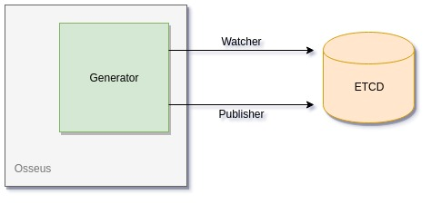

# Generator Plugin

The `Generator Plugin` facilitates watching ETCD for new changes/events, capturing those changes, and providing newly generated code of different plugin configurations back to ETCD in this sequence:

1. Sets a Watcher to monitor ETCD for new changes
2. Captures new changes if keyprefix is a match and begins code generation
3. Sends code generation back to etcd under new prefix

<p align="center">
    
</p>

## Quick Start

```bash
# First, run the docker image for etcd:
docker run -p 2379:2379 --name etcd --rm quay.io/coreos/etcd:v3.1.0 /usr/local/bin/etcd -advertise-client-urls http://0.0.0.0:2379 -listen-client-urls http://0.0.0.0:2379

# Then, run the generator:
cd cmd/agent/
go run main.go

# Lastly, execute a command on etcd to see generator operate:
etcdctl put /vnf-agent/vpp1/config/generator/v1/project/test '{"name":"test", "plugin": '['{"name":"grpc"}']'}'
```